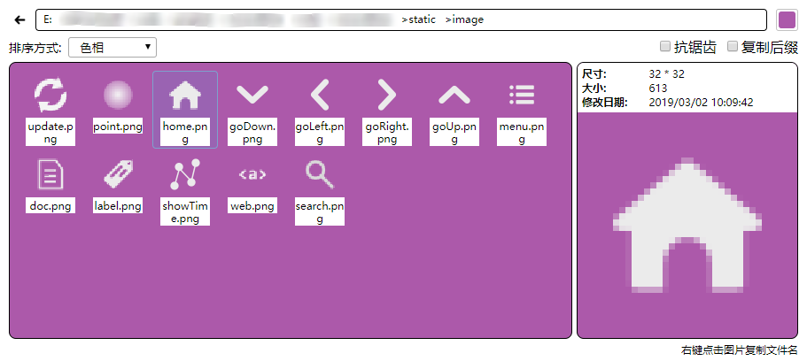

# imageViewer

[https://github.com/xxxxst/imageViewer](https://github.com/xxxxst/imageViewer)

图片查看器，用于替代操作系统默认的文件查看器

* 支持修改背景颜色，便于查看白色图标
* 支持按照色相排序，便于快速找到图标

服务端源码(Golang):

[https://github.com/xxxxst/comSqliteServer](https://github.com/xxxxst/comSqliteServer)

